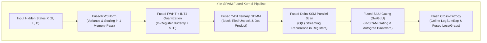

# ⚡ BitMC-SSM Custom Triton GPU Kernel Suite

This document provides a comprehensive technical and mathematical deep dive into the custom OpenAI Triton GPU kernels implemented for **BitMC-SSM**.



---

## 1. Flash Cross-Entropy (`python/triton_kernels/cross_entropy.py`)

### Problem Formulation
In language modeling with large vocabularies ($V = 50,257$), standard PyTorch cross-entropy requires computing and storing full logit tensors:
$$\text{Memory}(\text{Logits}) = B \times L \times V \times 2 \text{ bytes} \approx 64 \times 128 \times 50,257 \times 2 \approx 823 \text{ MB per step}$$
Reading and writing this huge tensor across high-bandwidth memory (HBM/VRAM) introduces severe memory bandwidth saturation and potential Out-Of-Memory (OOM) crashes.

### Mathematical Algorithm: Online LogSumExp in SRAM
Our Flash Cross-Entropy kernel processes vocabulary tiles in blocks of $B_V = 1024$ directly within GPU Shared Memory (SRAM):

1. **Online Max Tracking & Normalization**:
   $$m_i^{(k)} = \max\left(m_i^{(k-1)}, \max_{j \in \text{Block}_k} z_{i,j}\right)$$
   $$d_i^{(k)} = d_i^{(k-1)} \cdot e^{m_i^{(k-1)} - m_i^{(k)}} + \sum_{j \in \text{Block}_k} e^{z_{i,j} - m_i^{(k)}}$$

2. **Final Log-Loss**:
   $$\mathcal{L}_i = \left(\ln(d_i) + m_i\right) - z_{i, y_i}$$

3. **Fused Autograd Backward Pass**:
   $$\frac{\partial \mathcal{L}_i}{\partial z_{i,j}} = \frac{e^{z_{i,j} - m_i}}{d_i} - \mathbf{1}_{\{j = y_i\}}$$

> [!NOTE]
> **VRAM Footprint**: Reduced from **$O(B \cdot L \cdot V)$ down to $O(B \cdot L)$** — a **99.8% memory reduction** during loss computation.

---

## 2. Fused Fast Walsh-Hadamard Transform + INT4 STE (`python/triton_kernels/hadamard_act4.py`)

### Outlier Suppression Theory
Standard activations in deep language models suffer from extreme kurtosis ($>200$), creating high-magnitude outlier channels that destroy lower-bit quantization. Multiplying by an orthogonal Walsh-Hadamard matrix $\mathcal{H}_D$ redistributes activation energy evenly across all channels without altering inner products:

$$\mathbf{x}_{\text{rot}} = \frac{1}{\sqrt{D}} \mathcal{H}_D \mathbf{x}, \quad \text{where } \mathcal{H}_D \mathcal{H}_D^T = D \cdot \mathbf{I}_D$$

### In-Register Butterfly Computation
Instead of allocating dense $D \times D$ matrices in DRAM, the kernel computes radix-2 butterfly operations purely inside GPU register files:
```python
# Stage 1: Distance = 1
x_even, x_odd = x[0::2], x[1::2]
y_stage1 = concat(x_even + x_odd, x_even - x_odd)
# Stages 2..log2(D): Pure register shuffle
```

### Symmetric INT4 Quantization with STE
$$\gamma = \text{mean}(|\mathbf{x}_{\text{rot}}|), \quad \text{scale} = \frac{7.0}{1.5 \cdot \gamma}$$
$$\mathbf{x}_{q} = \text{clamp}\left(\left\lfloor \mathbf{x}_{\text{rot}} \cdot \text{scale} + 0.5 \right\rfloor, -8, 7\right) \cdot \frac{1}{\text{scale}}$$

$$\text{Backward (STE)}: \quad \frac{\partial \mathcal{L}}{\partial \mathbf{x}} = \frac{1}{\sqrt{D}} \mathcal{H}_D \frac{\partial \mathcal{L}}{\partial \mathbf{x}_q}$$

---

## 3. Fused Delta-SSM Parallel Scan (`python/triton_kernels/delta_ssm_scan.py`)

### State Transition Dynamics
Delta-SSM updates recurrent hidden states $h_t \in \mathbb{R}^S$ via continuous-discrete decay:
$$h_t = \lambda h_{t-1} + x_t, \quad \text{where } \lambda = \text{sigmoid}(\text{decay\_raw}) \in (0, 1)$$
$$y_t = h_t \cdot c_t$$

### DRAM-Eliminated Register Streaming
Traditional PyTorch implementations construct an $L \times L$ triangular decay matrix:
$$M_{t,s} = \lambda^{t-s} \quad (s \le t)$$
which consumes $O(B \times L^2 \times D \times S)$ VRAM.

Our Triton scan assigns one GPU thread block per $(B, D)$ channel. Each thread maintains state vector $h \in \mathbb{R}^{32}$ strictly in **GPU registers**, scanning sequentially across sequence length $L$:
* Time Complexity: $\mathcal{O}(L \cdot S)$
* Space Complexity: $\mathcal{O}(S)$ in registers ($0$ VRAM allocation for intermediate states).

---

## 4. Fused RMSNorm & Fused SiLU Gating (`python/triton_kernels/rmsnorm_silu.py`)

### 1. Fused RMSNorm
$$\text{RMSNorm}(\mathbf{x}) = \frac{\mathbf{x}}{\sqrt{\frac{1}{D}\sum_{k=1}^D x_k^2 + \epsilon}} \odot \mathbf{w}$$

* Forward & Backward fused into single GPU grid passes.
* Gradients $\nabla \mathbf{x}$ and $\nabla \mathbf{w}$ are accumulated in SRAM before committing to DRAM.

### 2. Fused SiLU Gating (SwiGLU)
$$y = (\text{silu}(f_1)) \odot f_2 = (f_1 \cdot \sigma(f_1)) \odot f_2$$

$$\frac{\partial y}{\partial f_1} = f_2 \cdot \left(\sigma(f_1) + f_1 \cdot \sigma(f_1) \cdot (1 - \sigma(f_1))\right)$$
$$\frac{\partial y}{\partial f_2} = f_1 \cdot \sigma(f_1)$$

---

## 5. Fused 2-Bit Ternary BitLinear GEMM (`python/triton_kernels/ternary_gemm.py`)

### 2D Block-Tiled Unpacking & Dot Product
Weights are represented as ternary values $\mathbf{W} \in \{-1, 0, +1\}^{N \times K}$.
The Triton kernel implements a tiled matrix multiplication:
* **Tile Dimensions**: $\text{BLOCK\_M} = 64, \text{BLOCK\_N} = 64, \text{BLOCK\_K} = 32$
* Unpacks 2-bit storage directly inside compute tiles without full float matrix reconstruction.

---

## 📊 Kernel Parity & Performance Benchmarks

### Verification Suite (`tests/test_triton_kernels.py`)
All kernels undergo strict numerical parity testing against 64-bit FP reference implementations:

| Test Case | Forward Parity | Backward (Grad) Parity | Tolerance |
| :--- | :---: | :---: | :---: |
| `test_cross_entropy_parity` | ✅ PASSED | ✅ PASSED | $\text{atol} \le 10^{-4}$ |
| `test_hadamard_act4_parity` | ✅ PASSED | ✅ PASSED | $\text{atol} \le 10^{-5}$ |
| `test_delta_ssm_scan_parity` | ✅ PASSED | ✅ PASSED | $\text{atol} \le 10^{-4}$ |
| `test_rmsnorm_parity` | ✅ PASSED | ✅ PASSED | $\text{atol} \le 10^{-4}$ |
| `test_silu_gating_parity` | ✅ PASSED | ✅ PASSED | $\text{atol} \le 10^{-4}$ |
| `test_ternary_gemm_parity` | ✅ PASSED | ✅ PASSED | $\text{atol} \le 10^{-4}$ |

---

## 💡 How to Use in Python

```python
import torch
from triton_kernels import (
    fused_cross_entropy,
    FusedRMSNorm,
    fused_silu_gating,
    fused_delta_ssm_scan,
    FusedHBitLinear,
)

# Automatic fallback to PyTorch if running on CPU or non-CUDA environment
norm = FusedRMSNorm(dim=384).cuda()
x = torch.randn(32, 128, 384, device="cuda", requires_grad=True)
y = norm(x)
```
